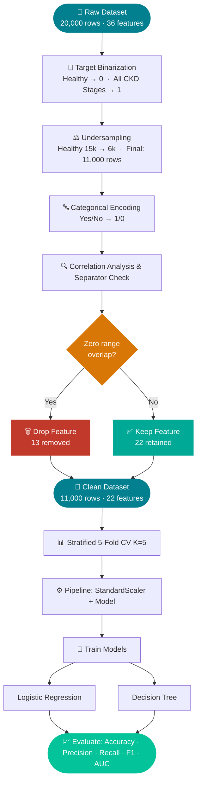
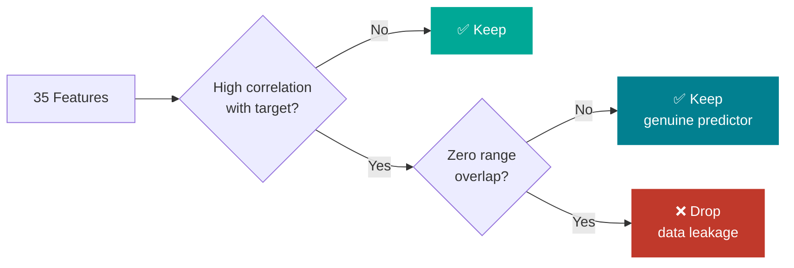
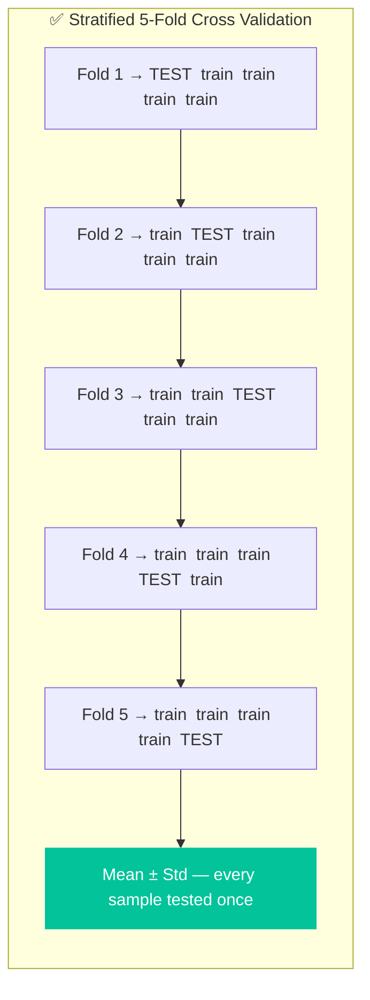

# Predicting Chronic Kidney Disease using Machine Learning Models
## by: Abbas Shafi (MS Data Science)

Binary ML classification on clinical CKD data using Logistic Regression and Decision Tree with 5-Fold Cross Validation.

---

## Files

| File | Description |
|------|-------------|
| [`Predicting_Chronic_Kidney_Disease_Using_Machine_Learning.ipynb`](./Predicting_Chronic_Kidney_Disease_Using_Machine_Learning.ipynb) | End-to-end pipeline notebook |
| [`Abbas Shafi-Project Presentation.pptx`](https://github.com/abbasshafi/Data-Mining/blob/main/Abbas%20Shafi-Project%20Presentation.pptx) | 15-slide project walkthrough |

---

## Dataset

**Chronic Kidney Disease (CKD) Clinical Dataset** — Priyanka Barik, Kaggle  
[→ View Dataset](https://www.kaggle.com/datasets/priyankabarik/chronic-kidney-disease-ckd-clinical-dataset)

| Records | Features | Missing Values | Task |
|---------|----------|----------------|------|
| 21,000 | 35 + 1 target | None | Binary Classification |

---

## Pipeline



---

## Feature Selection Logic

> Features were dropped **only if** they had high correlation **AND** zero range overlap between classes — evidence that values were assigned *from* the target label in this synthetic dataset, not measured independently.



| | Features |
|---|---|
| **Dropped (13)** | eGFR, Serum Albumin, Systolic BP, Diastolic BP, Hemoglobin, Bicarbonate, Packed Cell Volume, Phosphorus, Serum Creatinine, BUN, Urine Albumin, Urine Protein, ACR |
| **Kept (22)** | Potassium, HbA1c, Diabetes, Hypertension, Age, BMI, Gender, Heart Rate, Sodium, Chloride, Calcium, WBC, Platelet Count, Fasting Glucose, and more |

---

## Why K-Fold



`StandardScaler` lives inside the `Pipeline` — fits only on each fold's training data, guaranteeing zero leakage across folds.

---

## Results

Mean scores across 5 stratified folds:

| Model | Accuracy | Precision | Recall | F1 | AUC-ROC |
|-------|----------|-----------|--------|----|---------|
| Logistic Regression | 0.8861 | 1.0000 | 0.7561 | 0.8611 | 0.9377 |
| Decision Tree | 0.8846 | 0.9943 | 0.7572 | 0.8603 | 0.9385 |

- **Precision = 1.0 (LR)** — every CKD prediction is correct, zero false positives
- **Recall ≈ 0.756** — both models miss ~24% of CKD cases at default 0.5 threshold
- **AUC ≈ 0.938** — excellent discrimination across all classification thresholds

---

## Requirements

```bash
pip install pandas numpy scikit-learn matplotlib seaborn
```

---

## Citation

```
Barik, P. (2024). Chronic Kidney Disease (CKD) Clinical Dataset.
Kaggle. https://www.kaggle.com/datasets/priyankabarik/chronic-kidney-disease-ckd-clinical-dataset
```
