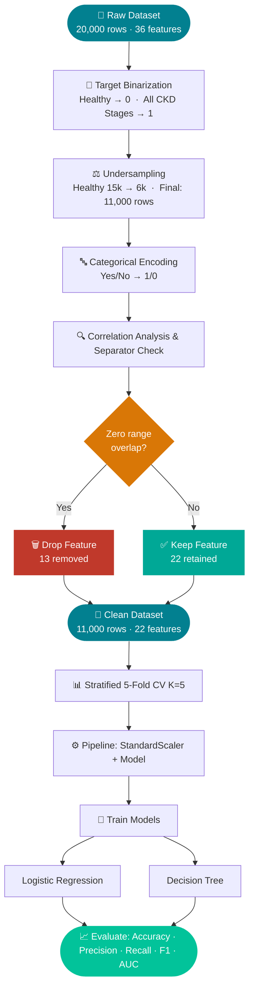
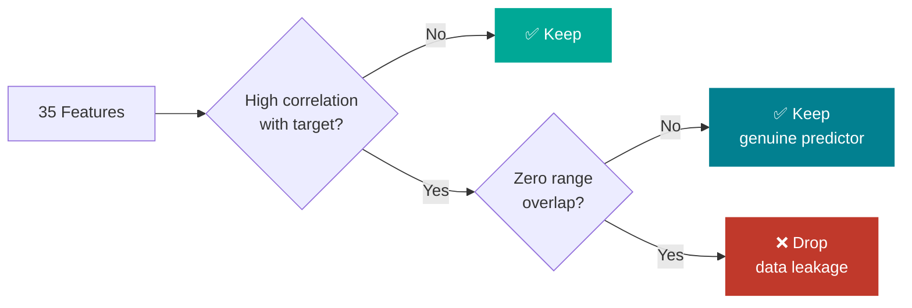
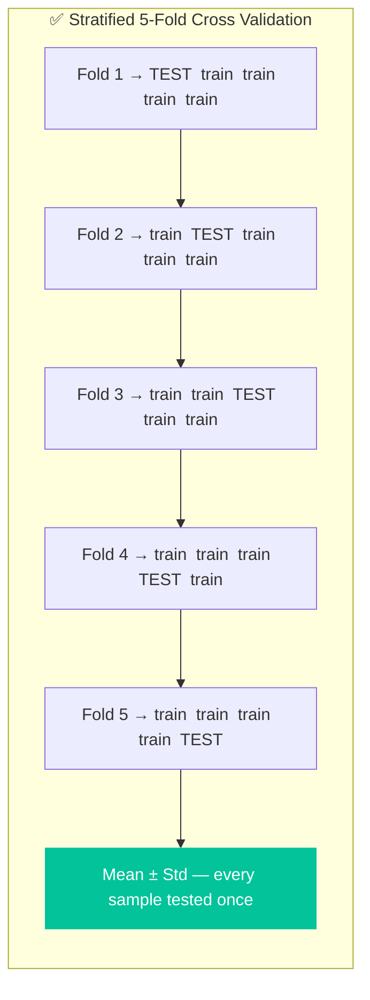

# Predicting Chronic Kidney Disease Using Machine Learning

> **Data Mining Assignment — Experimental Project Track**  
> Binary Classification Study on Clinical Biomarkers using Logistic Regression and Decision Tree with 5-Fold Cross Validation

---

## Repository Contents

| File | Description |
|------|-------------|
| [`Predicting_Chronic_Kidney_Disease_Using_Machine_Learning.ipynb`](./Predicting_Chronic_Kidney_Disease_Using_Machine_Learning.ipynb) | Full end-to-end Python pipeline — EDA, preprocessing, feature selection, model training, and evaluation |
| [`Abbas Shafi-Project Presentation.pptx`](https://github.com/abbasshafi/Data-Mining/blob/main/Abbas%20Shafi-Project%20Presentation.pptx) | 15-slide walkthrough presentation covering all project stages |

---

## Project Overview

Chronic Kidney Disease (CKD) affects approximately **10% of the global population** and is a leading cause of end-stage renal failure. Early detection is critical — patients diagnosed early can slow progression through lifestyle changes and medication, while late-stage detection often requires dialysis or transplantation.

This project builds a binary ML classification pipeline on a clinical CKD dataset to distinguish **Healthy Kidney** patients from **Non-Healthy (any CKD stage)** patients using 22 genuine risk-factor features.

---

## Dataset

| Property | Value |
|----------|-------|
| **Name** | Chronic Kidney Disease (CKD) Clinical Dataset |
| **Source** | Kaggle — Priyanka Barik |
| **URL** | [kaggle.com/datasets/priyankabarik/chronic-kidney-disease-ckd-clinical-dataset](https://www.kaggle.com/datasets/priyankabarik/chronic-kidney-disease-ckd-clinical-dataset) |
| **Records** | 20,000 |
| **Features** | 35 predictors + 1 target |
| **Missing Values** | None (0%) |
| **Original Target** | 5 classes (Healthy, Mild, Moderate, Severe CKD, Kidney Failure) |
| **After Binarization** | 2 classes (Healthy = 0, Non-Healthy = 1) |

---

## Pipeline Summary

### 1. Exploratory Data Analysis
- Descriptive statistics across all 35 features
- Class distribution analysis revealing 75:25 imbalance
- Identification of synthetically generated hard feature boundaries

### 2. Target Binarization
```python
df['Target_Binary'] = df['Target'].apply(
    lambda x: 0 if x == 'Healthy Kidney' else 1
)
```
All 4 CKD stages collapsed into a single Non-Healthy label (1). Clinically motivated — the most actionable screening question is whether any kidney disease is present.

### 3. Class Balancing — Random Undersampling
Majority class (Healthy) reduced from 15,000 to 6,000 samples:

| Class | Before | After |
|-------|--------|-------|
| Healthy (0) | 15,000 (75%) | 6,000 (55%) |
| Non-Healthy (1) | 5,000 (25%) | 5,000 (45%) |
| **Total** | **20,000** | **11,000** |

Undersampling was preferred over SMOTE to preserve real clinical observations without generating synthetic data.

### 4. Feature Selection — Correlation & Separator Analysis

**13 features were dropped** due to confirmed data leakage — these features had zero range overlap between classes, indicating that their values were assigned programmatically from the target label (a characteristic of synthetic data generation):

| Feature | Correlation | Reason for Dropping |
|---------|-------------|---------------------|
| Serum_Albumin | −0.88 | All Healthy = 4.0 exactly — machine generated |
| eGFR | −0.82 | Defines CKD staging — perfect separator |
| Diastolic_BP | +0.83 | Healthy: 60–79, CKD: 80–119 — zero overlap |
| Systolic_BP | +0.81 | Healthy: 90–119, CKD: 120–189 — zero overlap |
| Hemoglobin | −0.78 | Near-perfect separator confirmed |
| Bicarbonate | −0.74 | Near-perfect separator confirmed |
| Packed_Cell_Volume | −0.73 | Derived from Hemoglobin — redundant |
| Phosphorus | +0.72 | Near-perfect separator confirmed |
| Serum_Creatinine | +0.67 | Healthy all = 0, CKD: 1–9 — zero overlap |
| Blood_Urea_Nitrogen | +0.67 | Healthy: 7–19, CKD: 20–149 — zero overlap |
| Urine_Albumin | +0.58 | Perfect separator even after transform |
| Urine_Protein | +0.57 | Perfect separator even after transform |
| Albumin_Creatinine_Ratio | +0.54 | Perfect separator even after transform |

> **Important:** These are clinically valid features in real-world CKD diagnosis. They were excluded specifically because this **synthetic dataset** reversed the cause-effect direction — assigning feature values from the target label rather than measuring them independently. In a real hospital dataset, all of these features should be retained.

**22 features were retained** including Potassium, HbA1c, Diabetes, Hypertension, Age, BMI, Urine Specific Gravity, Smoking Status, electrolytes, blood counts, and metabolic markers — all with overlapping value ranges between classes.

### 5. Preprocessing
```python
# Categorical encoding (Yes/No → 1/0)
binary_cols = ['Diabetes', 'Hypertension', 'Smoking_Status', 'Family_History_Kidney']
df[col] = df[col].map({'Yes': 1, 'No': 0})
```

### 6. Stratified 5-Fold Cross Validation
5-Fold CV was used instead of a traditional 80/20 train-test split:

| | Train-Test Split | 5-Fold CV |
|--|-----------------|-----------|
| Data use | 20% never trained on | 100% used for both |
| Reliability | Single score | Mean ± Std across 5 folds |
| Variance | Depends on random_state | Measured and reported |
| Leakage risk | Low | Zero (scaler inside Pipeline) |

```python
skf = StratifiedKFold(n_splits=5, shuffle=True, random_state=42)

pipeline = Pipeline([
    ('scaler', StandardScaler()),   # fits only on training fold
    ('model',  LogisticRegression(...))
])
```
`StandardScaler` is embedded inside the `Pipeline` so it fits only on each fold's training data — preventing test fold statistics from leaking into the scaler.

---

## Models

### Logistic Regression
Models the probability of CKD using a linear combination of features. Preferred for clinical use — feature coefficients directly indicate which biomarkers increase or decrease CKD risk.

**Hyperparameters:** `solver=lbfgs`, `max_iter=1000`, `C=1.0` (L2), `class_weight=balanced`

### Decision Tree
Recursively splits the feature space using Gini impurity at each node. Captures non-linear relationships without feature scaling dependency. Depth limited to 5 to prevent overfitting.

**Hyperparameters:** `criterion=gini`, `max_depth=5`, `min_samples_leaf=20`, `class_weight=balanced`

---

## Results

Mean scores across 5 stratified folds:

| Model | Accuracy | Precision | Recall | F1 Score | AUC-ROC |
|-------|----------|-----------|--------|----------|---------|
| **Logistic Regression** | 0.8861 | 1.0000 | 0.7561 | 0.8611 | 0.9377 |
| **Decision Tree** | 0.8846 | 0.9943 | 0.7572 | 0.8603 | 0.9385 |

### Key Observations

- **Logistic Regression Precision = 1.0** — every patient flagged as CKD is a true CKD case (zero false positives). Clinically, it is safe to act on every positive prediction.
- **Recall ≈ 0.756** for both models — approximately 24% of actual CKD patients are missed at the default 0.5 threshold. This is the primary limitation.
- **Near-identical results** across two algorithmically different models confirms the remaining 22 features carry genuine, consistent predictive signal.
- **AUC ≈ 0.938** for both — excellent discriminative ability across all classification thresholds.

---

## Limitations

- **Synthetic dataset** — 13 features exhibited machine-generated hard boundaries, requiring removal. Results on real clinical data may differ.
- **Recall gap** — 24% of CKD patients missed at threshold 0.5. Lowering the decision threshold to 0.3 can improve recall at the cost of some precision.
- **No external validation** — model evaluated on held-out folds of the same synthetic dataset only.

---

## Future Work

- SHAP values for individual patient-level explainability
- SMOTE oversampling as an alternative to undersampling
- VIF analysis to address remaining multicollinearity
- Additional models: KNN, Naive Bayes, Random Forest
- Validation on a real clinical CKD dataset (e.g., UCI CKD dataset)

---

## Requirements

```bash
pip install pandas numpy scikit-learn matplotlib seaborn
```

| Library | Version |
|---------|---------|
| Python | ≥ 3.8 |
| pandas | ≥ 1.3 |
| numpy | ≥ 1.21 |
| scikit-learn | ≥ 1.0 |
| matplotlib | ≥ 3.4 |
| seaborn | ≥ 0.11 |

---

## How to Run

```bash
# Clone the repository
git clone https://github.com/abbasshafi/Data-Mining.git
cd Data-Mining

# Install dependencies
pip install pandas numpy scikit-learn matplotlib seaborn

# Open the notebook
jupyter notebook Predicting_Chronic_Kidney_Disease_Using_Machine_Learning.ipynb
```

Replace the dataset filename on the first cell with your local path to the CKD CSV file before running.

---

## Citation

```
Barik, P. (2024). Chronic Kidney Disease (CKD) Clinical Dataset.
Kaggle. https://www.kaggle.com/datasets/priyankabarik/chronic-kidney-disease-ckd-clinical-dataset
```

---

*Data Mining Assignment — Experimental Project Track*
# Chronic Kidney Disease — Binary Classification

Binary ML classification on clinical CKD data using Logistic Regression and Decision Tree with 5-Fold Cross Validation.

---

## Files

| File | Description |
|------|-------------|
| [`Predicting_Chronic_Kidney_Disease_Using_Machine_Learning.ipynb`](./Predicting_Chronic_Kidney_Disease_Using_Machine_Learning.ipynb) | End-to-end pipeline notebook |
| [`Abbas Shafi-Project Presentation.pptx`](https://github.com/abbasshafi/Data-Mining/blob/main/Abbas%20Shafi-Project%20Presentation.pptx) | 15-slide project walkthrough |

---

## Dataset

**Chronic Kidney Disease (CKD) Clinical Dataset** — Priyanka Barik, Kaggle  
[→ View Dataset](https://www.kaggle.com/datasets/priyankabarik/chronic-kidney-disease-ckd-clinical-dataset)

| Records | Features | Missing Values | Task |
|---------|----------|----------------|------|
| 20,000 | 35 + 1 target | None | Binary Classification |

---

## Pipeline



---

## Feature Selection Logic

> Features were dropped **only if** they had high correlation **AND** zero range overlap between classes — evidence that values were assigned *from* the target label in this synthetic dataset, not measured independently.



| | Features |
|---|---|
| **Dropped (13)** | eGFR, Serum Albumin, Systolic BP, Diastolic BP, Hemoglobin, Bicarbonate, Packed Cell Volume, Phosphorus, Serum Creatinine, BUN, Urine Albumin, Urine Protein, ACR |
| **Kept (22)** | Potassium, HbA1c, Diabetes, Hypertension, Age, BMI, Gender, Heart Rate, Sodium, Chloride, Calcium, WBC, Platelet Count, Fasting Glucose, and more |

---

## Why K-Fold



`StandardScaler` lives inside the `Pipeline` — fits only on each fold's training data, guaranteeing zero leakage across folds.

---

## Results

Mean scores across 5 stratified folds:

| Model | Accuracy | Precision | Recall | F1 | AUC-ROC |
|-------|----------|-----------|--------|----|---------|
| Logistic Regression | 0.8861 | 1.0000 | 0.7561 | 0.8611 | 0.9377 |
| Decision Tree | 0.8846 | 0.9943 | 0.7572 | 0.8603 | 0.9385 |

- **Precision = 1.0 (LR)** — every CKD prediction is correct, zero false positives
- **Recall ≈ 0.756** — both models miss ~24% of CKD cases at default 0.5 threshold
- **AUC ≈ 0.938** — excellent discrimination across all classification thresholds

---

## Requirements

```bash
pip install pandas numpy scikit-learn matplotlib seaborn
```

---

## Citation

```
Barik, P. (2024). Chronic Kidney Disease (CKD) Clinical Dataset.
Kaggle. https://www.kaggle.com/datasets/priyankabarik/chronic-kidney-disease-ckd-clinical-dataset
```
